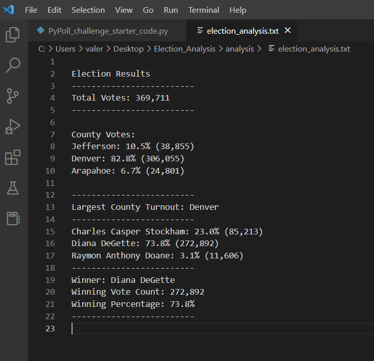

# Election Analysis

## Project Overview

The Colorado Board of Elections employee has given me the following tasks to complete the election audit of a recent local congressional election.

1. Calculate the total number of votes cast.
2. Get a complete list of candidates who received votes.
3. Calculate the total number of votes each candidate received received.
4. Calculate the percentage of votes each candidate won.
5. Determine the winner of the election based on populat vote.

## Resources

- Data Source: election_results.cv
- Software: Python 3.7.6, Visual Studio Code 1.74.0

## Summary

The analysis of the election show that:

- There were a total of 369,711 cast in this election.
- The candidates were:
    - Charles Casper Stockham
    - Diana DeGette
    - Raymon Anthony Doane
- The candidate results were:
    - Charles Casper Stockham received 23.0% of the vote and 85,213 number of votes.
    - Diana DeGette received 73.8% of the vote and 272,892 number of votes. 
    - Raymon Anthony Doane received 3.1% of the vote and 11,606 number of votes.
-The winner of the election was: 
    - Diana DeGette, who received 73.8% of the vote and 272,892 number of votes.

